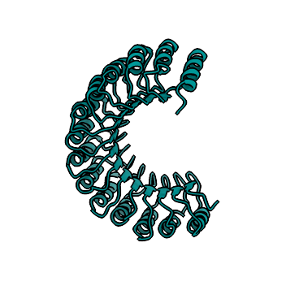
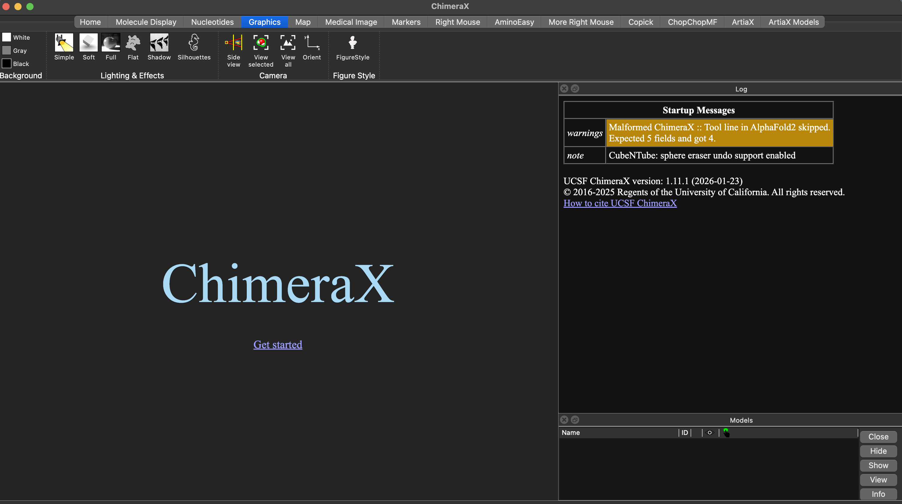
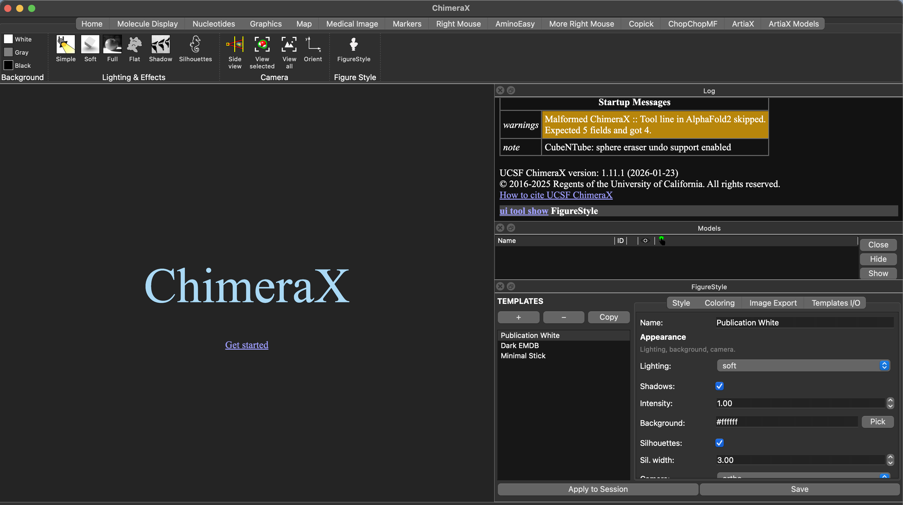
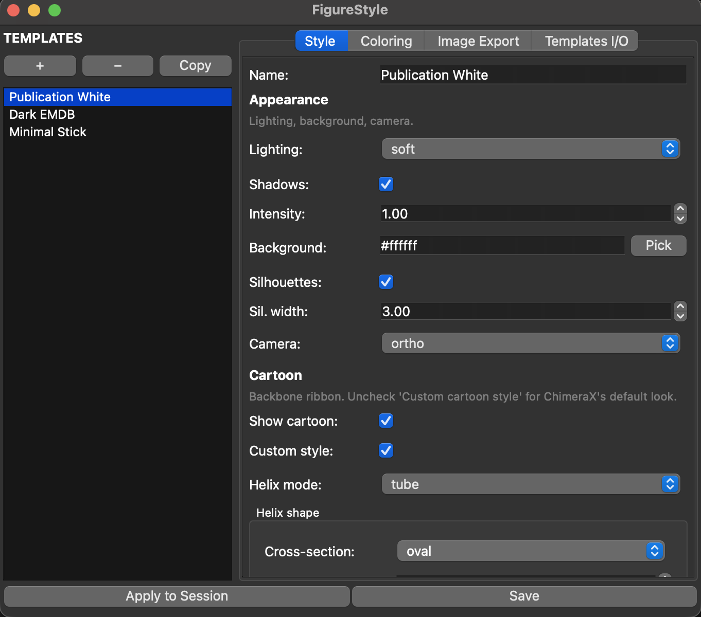
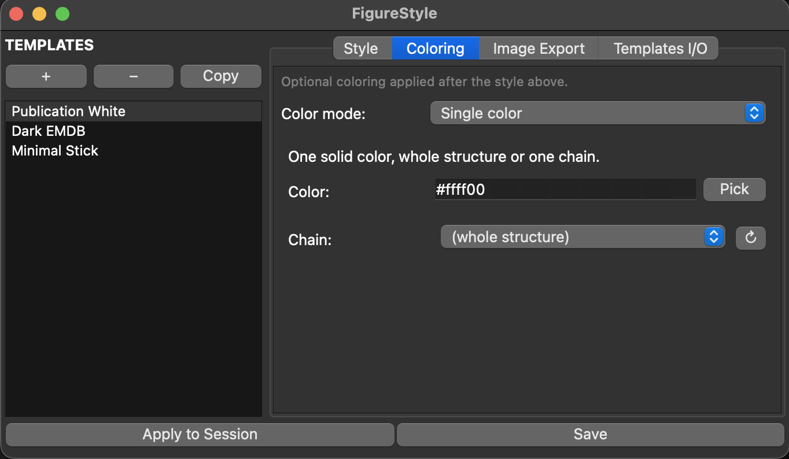
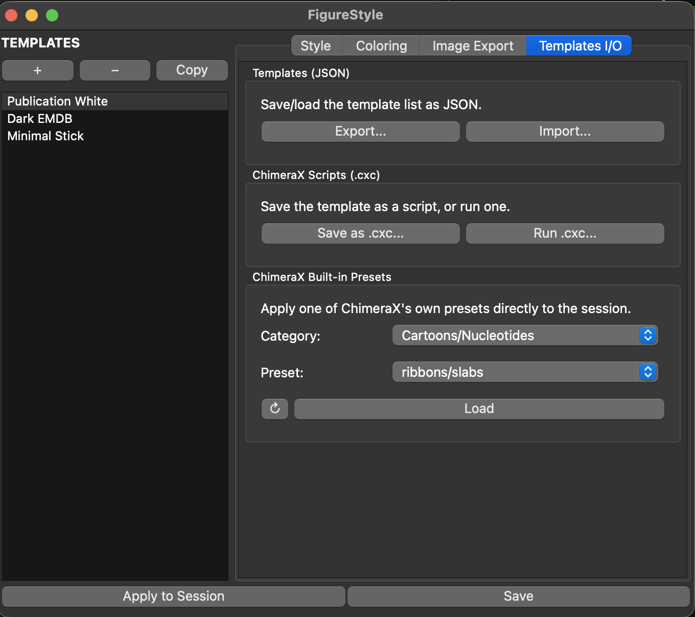

<p align="center">
  
</p>

# FigureStyle — User Guide

You rewrite the same lighting, background, cartoon-style, and export commands for every figure?
FigureStyle turns that into a one-click template: define lighting, per-secondary-structure cartoon
style, coloring (including AlphaFold pLDDT), and export settings once, save it under a name, and
apply it to any structure — from the GUI or the command line.

## Before you start: preparing your structure

FigureStyle styles whatever's already open — it doesn't edit the structure itself. If you need to
crop, mutate, fetch from AlphaFold/PDB, or otherwise prepare a model first, a sibling ChimeraX
plugin covers that step:

<a href="https://lukasinscience.github.io/ChopChopMF/usage/">
  
  <b>ChopChopMF</b>
</a> — use it to get the structure into shape, then FigureStyle to style and export the figure.

## Finding it in ChimeraX

Once installed, FigureStyle adds a button under the **Graphics** tab of ChimeraX's toolbar:



You can also open it via **Tools → General → FigureStyle**, or from the command line:
```
ui tool show "FigureStyle"
```

## The tool panel

The tool docks as a panel: a template list on the left, four tabs on the right (**Style**,
**Coloring**, **Image Export**, **Templates I/O**), and **Apply to Session** / **Save** always
visible at the bottom.



The Style tab's Cartoon section controls per-type helix/strand/coil shape:



## Creating and editing a template

1. Click **+** in the template list for a blank template, or select one and click **Copy** to
   duplicate it under a new name.
2. Edit settings across **Style** (lighting, background, cartoon, atoms), **Coloring**, and
   **Image Export**.
3. Click **Save** to write your changes back to the selected template — this does not touch your
   current ChimeraX session.
4. Click **Apply to Session** to actually run the template's style on whatever is open right now.

Renaming: change the **Name** field, then **Save** — a name collision asks whether to overwrite.

The three built-in templates (Publication White, Dark EMDB, Minimal Stick) can't be overwritten or
deleted directly — copy one first if you want to build on it.

## Coloring



Pick a **Color mode**: None, Single color (optionally restricted to one open chain), By chain
(rainbow palette), By B-factor (with a color key), By heteroatom, or AlphaFold pLDDT — colors
ligands/waters and the whole structure by AlphaFold's own confidence scale automatically.

## Image export

Set width/height/supersample/format (PNG, JPEG, TIFF) and whether the background should be
transparent (only meaningful for PNG/TIFF — JPEG has no alpha channel and always exports opaque),
then click **Save Image...** to render the current ChimeraX view with those settings.

## Backing up and sharing templates



In **Templates I/O**:
- **Export...** / **Import...** — save your whole template list to a JSON file, or load one back
  in. Same-named templates are overwritten, new names are added alongside your existing ones.
- **Save as .cxc...** / **Run .cxc...** — turn a template into a standalone ChimeraX script (or run
  one), no plugin required to use the script afterward.
- **ChimeraX Built-in Presets** — apply one of ChimeraX's own presets directly, independent of your
  saved templates.

### Sharing a template you made with others

1. **Templates I/O → Export...** for a `.json` file, or **Save as .cxc...** for a standalone
   script.
2. Send that file directly to whoever you want to share it with — they use **Import...** (or
   **Run .cxc...**) to load it in.
3. To contribute it back for other users to discover, submit the `.json` or `.cxc` file either way:
   - Open a [GitHub Issue or pull request](https://github.com/LUKASinScience/ChimeraX-FigureStyle/issues)
     with the file attached, or
   - Email it to **lukasinscience@gmail.com**

   Include a short description of what it's for. Accepted submissions get added to the
   [`community-templates/`](community-templates/) folder in the repo.

### Community templates

Browse and download templates other users have submitted:
[`community-templates/`](community-templates/) — download the file, then **Import...** (`.json`)
or **Run .cxc...** (`.cxc`) as above. Nothing's been submitted yet — be the first.

## Command line

```
figurestyle apply "Template Name"
```
Applies a saved template's style to the current session — useful in scripts or for styling many
figures without opening the GUI each time.

## Citation

If FigureStyle helped produce a figure in a paper or presentation, a mention of
"ChimeraX-FigureStyle (Lukas W. Bauer)" is appreciated but not required. Machine-readable citation
metadata is in [`CITATION.cff`](CITATION.cff).

## License

MIT — see [`LICENSE.txt`](LICENSE.txt).

## Authors

Lukas W. Bauer, with AI-assisted development by Claude (Anthropic).
